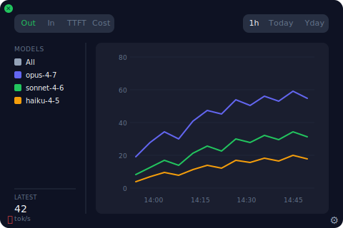
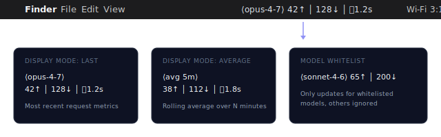
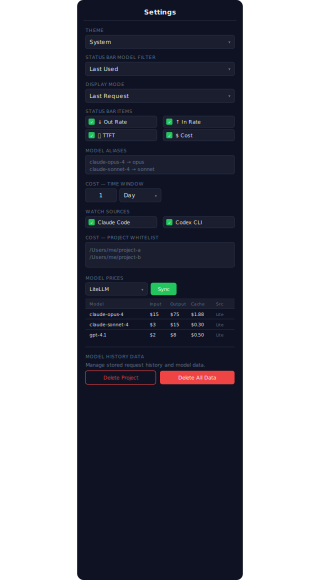

# CC Monitor

Real-time Claude Code performance metrics in your macOS menu bar.

CC Monitor watches Claude Code's JSONL session logs, parses every API request, and displays live throughput stats (tok/s, TTFT) directly in the macOS status bar. Click to open a chart popover with historical data by model.



## Features

**Live Menu Bar Metrics**

Your current Claude Code performance at a glance — output rate, input rate, and time-to-first-token, updating in real-time as requests complete.



**Multi-Model Tracking**

Tracks all Claude models separately (Opus, Sonnet, Haiku) with color-coded chart lines. Filter by model in the sidebar or whitelist specific models for the status bar.

**Interactive Chart**

- Time ranges: 1 hour, today, yesterday
- Metrics: output tok/s, input tok/s, TTFT
- Data aggregation: 5-min buckets (1h), 30-min (today), 1-hour (yesterday)
- Smooth lines with per-model color coding
- Tooltip with exact values on hover

**Configurable Settings**



- **Theme**: System / Dark / Light
- **Display mode**: Last request or rolling average (configurable window)
- **Model filter**: Show all or whitelist specific models
- **Status bar items**: Choose and reorder which metrics appear (out_rate, in_rate, ttft)
- **Model aliases**: Shorten long model names (e.g., `claude-opus-4-7` → `opus`)

## Install

Download the `.dmg` from [Releases](../../releases/latest), drag to Applications, and launch.

CC Monitor runs as a menu bar app (no Dock icon). Click the metrics text in the menu bar to toggle the chart popover.

## How It Works

CC Monitor polls `~/.claude/projects/` for JSONL session logs every 500ms. When a new assistant response is detected, it calculates:

- **Output rate**: `output_tokens / duration`
- **Input rate**: `input_tokens / duration`
- **TTFT**: Time from user message to assistant response

All data is stored locally in SQLite (`~/Library/Application Support/cc-monitor/data.db`).

## Tech Stack

- **Backend**: Rust + Tauri 2
- **Frontend**: React 19 + TypeScript + Tailwind CSS 4
- **Charts**: ECharts 6
- **Storage**: SQLite (rusqlite)
- **Platform**: macOS (Apple Silicon)

## Build from Source

```bash
# Prerequisites: Rust, Node.js

# Install dependencies
npm install

# Development
npm run tauri dev

# Build DMG
npm run tauri build
```

## License

[MIT](LICENSE)
